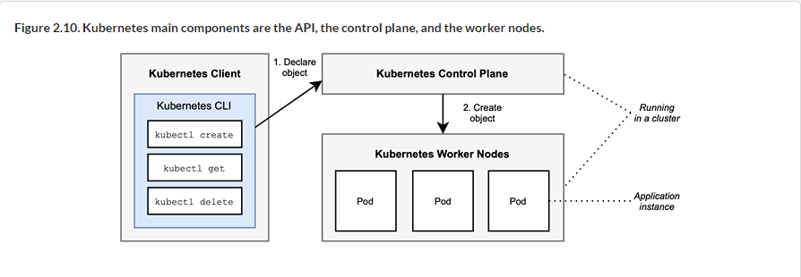
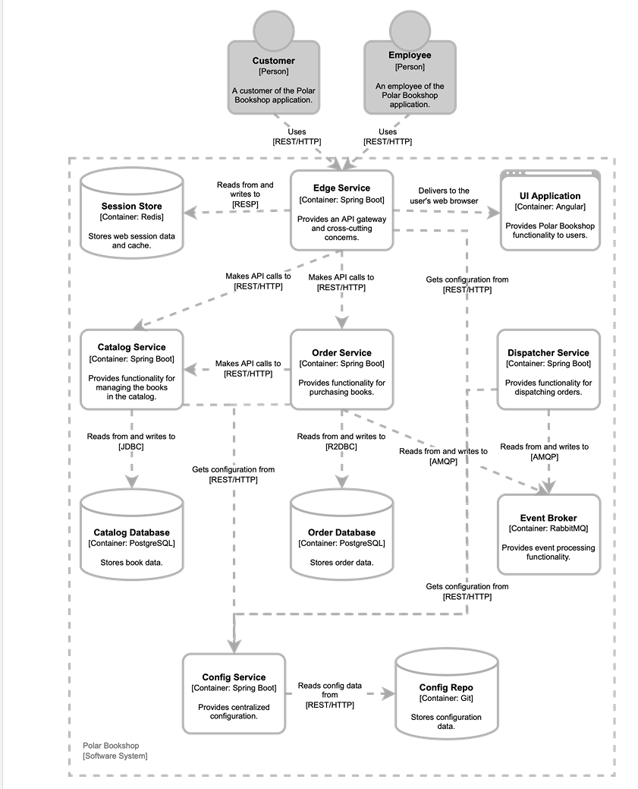

start spring = /gradlew bootRun
build image = ./gradlew bootBuildImage
run container =docker run --rm --name catalog-service -p 8080:8080 catalog-service:0.0.1-SNAPSHOT
--rm removes container after execution is complete

## kubernetes
- a k8's cluster is a set of worker machines (nodes) that runs containers
    - every cluster has at least one worker node
- control plane manages worker nodes.it exposes the api and interfaces to define/deploy/manage the lifecycle of containers

- Pod = the smalles deployable unit, usually contains only one application + sometimes support containers for admin tasks
- Deployment = informs k8's about the desired state for each instance it creates a pod
- Service = a deployment(set of pods) can be exposed to other nodes in the cluster or outside, by defining a Service that also takes care of balancing the load of pod
- resouce manifest = when you want to run a new application
### resouce manifest will be covered later
- by default minikube searches docker hub but the image can be imported to your local
- minikube image load catalog-service:0.0.1-SNAPSHOT = load image in local cluster
- kubectl create deployment catalog-service --image=catalog-service:0.0.1-SNAPSHOT :
    - creates a deployment resouce that will make k8 create app instances as pod resouces
- kubectl get pod = behind the scenes k8 creates the pod based on deployment
- by default apps deployed in k8's are not accsible
    - kubectl expose deployment catalog-service --name=catalog-service --port=8080 = expose catalog service
- the Service object exposes apps to other components inside the cluster
    - kubectl get service catalog-service
- you can forward traffic from the local port to the port exposed by the Service itslef
    - kubectl port-forward service/catalog-service 8000:8080

### deleting stuff
kubectl delete service catalog-service
kubectl delete deployment catalog-service

# Architecture
