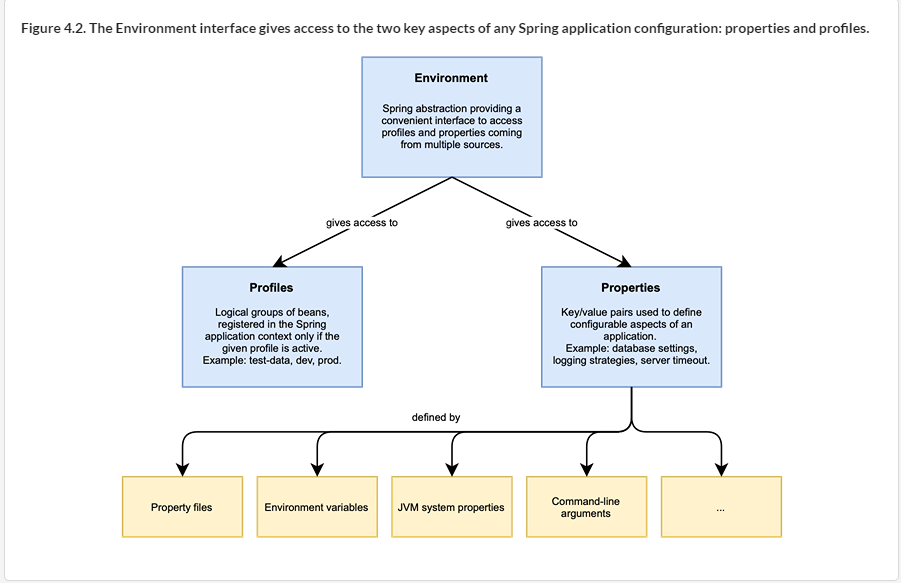
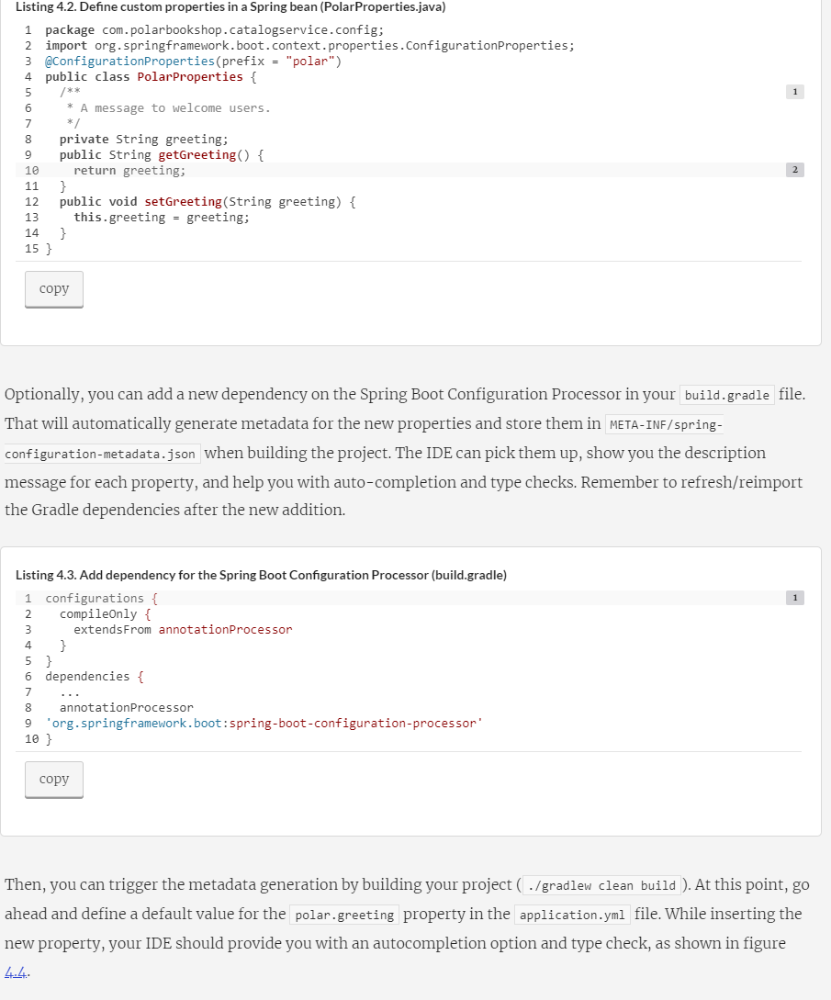

- Spring provides you with a convenient Environment abstraction that gives you access to any configuration data, no matter its source.

- @ConfigurationProperties - is as a holder of configuration data

# Profiles: Feature flags and configuration groups
- Beans assigned to the default profile are only activated when no other profile is active. Spring Boot extends this concept to property files, allowing to define groups of configuration data that are loaded only if a specific profile is active.

- A common mistake is using profiles like dev or prod to load beans conditionally. If you do that, the application will be coupled with the environment, which is usually not what we want for a cloud native application.

- Consider the case where you deploy applications to three different environments (development, test, production) and define three profiles accordingly to load certain beans conditionally (dev, test, prod). At some point, you decide to add a staging environment, where you also want to enable the beans marked with the prod profile.

- add a new com.polarbookshop.catalogservice.demo package to your Catalog Service project and create a BookDataLoader class. You can instruct Spring to load this class only when the testdata profile is active by applying the @Profile annotation.

- configuring it specifically for the local development environment when running the bootRun task. You can achieve that by adding the following to the build.gradle file.
    - bootRun {
  systemProperty 'spring.profiles.active', 'testdata'
}

# Summary
- The Spring Environment abstraction provides a unified interface to access properties and profiles.
Properties are key/value pairs used to store configuration.

- Profiles are logical groups of beans registered only when a specific profile is active.

- Spring Boot collects properties from different sources according to precedence rules. From the highest to the lowest precedence, properties can be defined in command-line arguments, JVM system variables, OS environment variables, profile-specific property files, and generic property files.

- Spring beans can access properties from the Environment object, by injecting the value with the @Value annotation, or from a bean mapped to a set of properties with the @ConfigurationProperties annotation.

- The active profiles can be defined with the spring.profiles.active property.

- The @Profile annotation marks beans or configuration classes to be considered only when the specified profile is active.

- Properties, as managed in Spring Boot, provide externalized configuration as defined by the 15-Factor methodology, but that’s not enough.

- A configuration server handles aspects like secret encryption, configuration traceability, versioning, and context refreshing at runtime with no restart.

- A configuration server can be set up with the Spring Cloud Config Server library.

- The configuration itself can be stored according to different strategies, such as in a dedicated Git repository.

- The config server uses application name, active profiles, and Git-specific labels to identify which configuration should be provided to which application.

- A Spring Boot application can be configured through a config server using the Spring Cloud Config Client library.

- @ConfigurationProperties beans are configured to listen to RefreshScopeRefreshedEvent.

- RefreshScopeRefreshedEvent can be triggered after a new change is pushed to the configuration repository so that the client application reloads the context using the latest configuration data.

- Spring Boot Actuator defines an /actuator/refresh endpoint that you can use to trigger the event manually.